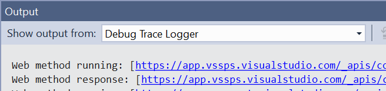

# Debug Trace Logger

<!-- Update the VS Gallery link after you upload the VSIX-->
Download this extension from the [VS Gallery](https://visualstudiogallery.msdn.microsoft.com/[GuidFromGallery])
or get the [CI build](http://vsixgallery.com/extension/a299a65a-dcf1-4271-96ca-4fd4c4f80b90/).

---------------------------------------

Allows Visual Studio extension authors to easily see any debug and trace statements in a custom Output Window pane.

See the [change log](CHANGELOG.md) for changes and road map.

## Output Window
Any call to `System.Diagnostics.Debug.Write` and `System.Diagnostics.Trace.Write` will be shown in a custom output window pane.

This makes it easy to diagnose the extension running in Visual Studio.

## Contribute
Check out the [contribution guidelines](.github/CONTRIBUTING.md)
if you want to contribute to this project.

For cloning and building this project yourself, make sure
to install the
[Extensibility Tools 2015](https://visualstudiogallery.msdn.microsoft.com/ab39a092-1343-46e2-b0f1-6a3f91155aa6)
extension for Visual Studio which enables some features
used by this project.

## License
[Apache 2.0](LICENSE)